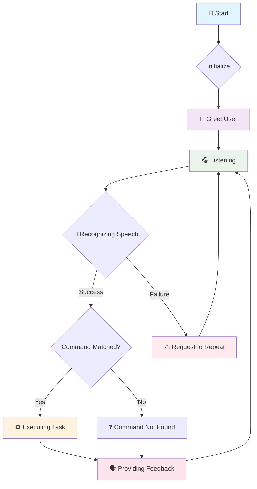

# 🔧 Delta Assistant - Logical Design

*A deep dive into the application's workflow, states, and core logic architecture.*

---

## 📋 Navigation Menu
- [🚀 Application Workflow](#application-workflow)
- [🔄 State Transition Diagram](#state-transition-diagram)
- [🧵 Core Logic & Threading](#core-logic--threading)
- [⚙️ Command Processing Flow](#command-processing-flow)
- [🛠️ Implementation Details](#implementation-details)

---

<details>
<summary><h2 id="application-workflow">🚀 Application Workflow</h2></summary>

### 🏗️ Operational Flow Overview

The Delta Assistant operates on a **continuous, event-driven loop**. The workflow is designed to be sequential and robust, ensuring a clear path from user input to system response.

```
┌─────────────────────────────────────────────────────────┐
│              DELTA ASSISTANT - OPERATIONAL FLOW         │
├─────────────────────────────────────────────────────────┤
│                                                         │
│   🚀 1. INITIALIZATION                                  │
│      ├── Electron UI is launched.                       │
│      ├── User clicks "Start".                           │
│      └── Python backend (delta.py) is spawned.          │
│      └── Assistant delivers a time-based greeting.      │
│                                                         │
│   🎧 2. LISTENING STATE                                 │
│      ├── The main loop begins.                          │
│      └── The microphone is activated to listen for a    │
│          voice command via the takecommand() function.  │
│                                                         │
│   🧠 3. PROCESSING STATE                                │
│      ├── Captured audio is sent to Google Web Speech API. │
│      └── The API transcribes the audio into a string.   │
│                                                         │
│   ⚙️ 4. EXECUTION & ROUTING STATE                        │
│      ├── The transcribed string is converted to lowercase.│
│      └── The query is passed through a command router   │
│          (if/elif block) to find a keyword match.       │
│                                                         │
│   🗣️ 5. FEEDBACK & LOOP                                 │
│      ├── The matched command's function is executed.    │
│      ├── Auditory feedback is provided via speak().     │
│      └── The system returns to the LISTENING STATE.     │
│                                                         │
└─────────────────────────────────────────────────────────┘
```

</details>

---

<details>
<summary><h2 id="state-transition-diagram">🔄 State Transition Diagram</h2></summary>

### 🤖 Finite State Machine Model

The assistant can be modeled as a **finite state machine**. Each state represents a distinct operational mode, with transitions triggered by specific events like successful speech recognition or errors.

### Key States:

- **🎧 Listening**: The default state, actively waiting for user speech
- **🧠 Recognizing**: A transient state where captured audio is being processed
- **⚙️ Executing**: The state where a matched command's logic is being run
- **🗣️ Feedback**: The state for providing a spoken response to the user
- **⚠️ Error/Retry**: A state entered when speech is not understood, prompting the user to repeat

### 🔀 State Flow Diagram



### 📊 State Descriptions

| State | Duration | Triggers | Next State |
|-------|----------|----------|-----------|
| **🎧 Listening** | Indefinite | Voice input detected | 🧠 Recognizing |
| **🧠 Recognizing** | 1-3 seconds | Speech processing complete | ⚙️ Executing or ⚠️ Error |
| **⚙️ Executing** | Variable | Command execution complete | 🗣️ Feedback |
| **🗣️ Feedback** | 1-5 seconds | Speech output complete | 🎧 Listening |
| **⚠️ Error/Retry** | 2-3 seconds | Error acknowledgment | 🎧 Listening |

</details>

---

<details>
<summary><h2 id="core-logic--threading">🧵 Core Logic & Threading</h2></summary>

### 🏗️ Threading Architecture

A critical design choice is the **separation of the core assistant logic** from the main application thread. This prevents the UI from freezing while the assistant is listening or processing, which are blocking operations.

### Architecture Overview:

```
     Main Application Thread (Electron / Potential Python UI)
┌─────────────────────────────────────────────────────────────┐
│ • Renders UI elements (buttons, animations)                 │
│ • Handles user clicks                                       │
│ • Remains responsive at all times                           │
└─────────────────────────────────────────────────────────────┘
                             |
                             | Spawns
                             ▼
                  DeltaThread (Background Worker)
┌─────────────────────────────────────────────────────────────┐
│ • Runs the entire assistant logic (wish, takecommand, run)  │
│ • All blocking I/O (microphone listening) happens here      │
│ • Does not affect the responsiveness of the main thread     │
└─────────────────────────────────────────────────────────────┘
```

### ⚡ Threading Benefits

| Benefit | Description |
|---------|-------------|
| **🚀 UI Responsiveness** | Main thread never blocks |
| **🎧 Continuous Listening** | Background processing doesn't interrupt UI |
| **⚡ Performance** | Parallel execution of UI and voice processing |
| **🛡️ Error Isolation** | Voice processing errors don't crash UI |

### 💻 Implementation Snippet

```python
from PyQt5.QtCore import QThread

class DeltaThread(QThread):
    """
    Runs the assistant's core logic in a separate thread
    to prevent the GUI from freezing.
    """
    def __init__(self):
        super().__init__()
        self.query = ""

    def takecommand(self):
        # ... listens for microphone input (blocking)
        pass

    def run(self):
        """The main loop for the assistant."""
        self.wish()
        while True:
            query = self.takecommand()
            # ... processes the query
```

</details>

---

<details>
<summary><h2 id="command-processing-flow">⚙️ Command Processing Flow</h2></summary>

### 🎯 Command Router Logic

Once speech is converted to a text query, the logical core is a **command router**. In the current implementation, this is a procedural if/elif/else structure that performs keyword matching.

### Logical Flow:

1. A lowercase query string is received from the `takecommand()` function
2. The string is checked against a series of conditions
3. Each condition looks for the presence of a specific keyword (e.g., "notepad", "weather")
4. The first condition that evaluates to True has its associated code block executed
5. If no conditions match, the loop continues, and the assistant returns to the listening state

### 🔀 Processing Flow Diagram

```
[ User Query: "what is the weather?" ]
                    │
                    ▼
┌─────────────────────────────────────────────────────────┐
│           COMMAND ROUTER (in run() loop)               │
├─────────────────────────────────────────────────────────┤
│                                                         │
│   Is "notepad" in query? ───(No)───> Continue           │
│                                                         │
│   Is "camera" in query? ────(No)───> Continue           │
│                                                         │
│   Is "weather" in query? ───(Yes)──> Execute get_weather() │
│                                                         │
│   Is "wikipedia" in query? ─(Stops)─> Loop restarts      │
│                                                         │
│   ... and so on                                         │
│                                                         │
└─────────────────────────────────────────────────────────┘
```

### 🔄 Command Processing Steps

| Step | Action | Example |
|------|--------|---------|
| **1** | Receive query | `"What is the weather?"` |
| **2** | Convert to lowercase | `"what is the weather?"` |
| **3** | Keyword matching | Search for `"weather"` |
| **4** | Execute function | `get_weather()` |
| **5** | Provide feedback | `speak("Current weather is...")` |
| **6** | Return to listening | Loop continues |

</details>

---

<details>
<summary><h2 id="implementation-details">🛠️ Implementation Details</h2></summary>

### 🔧 Core Functions

| Function | Purpose | Parameters | Returns |
|----------|---------|------------|---------|
| `wish()` | Time-based greeting | None | None (speaks greeting) |
| `takecommand()` | Voice input capture | None | String (recognized text) |
| `speak()` | Text-to-speech output | text: str | None |
| `run()` | Main assistant loop | None | None (infinite loop) |

### 🛠️ Technology Stack

- **🎙️ Speech Recognition**: Google Web Speech API
- **🔊 Text-to-Speech**: System TTS
- **🖥️ UI Framework**: Electron
- **🐍 Backend**: Python with PyQt5
- **🧵 Threading**: PyQt5.QThread

### 📐 Design Patterns

| Pattern | Usage | Benefit |
|---------|-------|---------|
| **State Machine** | Voice assistant states | Clear state transitions |
| **Command Pattern** | Command routing | Easy to extend commands |
| **Observer Pattern** | UI updates | Loose coupling |
| **Thread Pool** | Background processing | Non-blocking operations |

</details>

---


## 🎯 Quick Reference

### Command Structure
```python
if 'keyword' in query:
    # Execute command logic
    speak("Response message")
```

### Adding New Commands

<details>
<summary><strong>Click to view: How to add new commands</strong></summary>

1. **Add keyword check** in the command router
2. **Implement command function**
3. **Add appropriate speech feedback**
4. **Test with various voice inputs**

Example:
```python
elif 'calculator' in query:
    speak("Opening calculator")
    os.system("calc")
```

</details>

### Common Issues & Solutions

<details>
<summary><strong>Click to expand: Troubleshooting Guide</strong></summary>

| Issue | Cause | Solution |
|-------|-------|----------|
| **Speech not recognized** | Microphone issues | Check audio input settings |
| **Commands not executing** | Keyword mismatch | Verify keyword spelling |
| **UI freezing** | Blocking operations | Ensure threading is working |
| **No audio output** | TTS issues | Check system audio settings |

</details>

---

### 📌 Notes

> **Design Philosophy**: This keyword-matching approach is simple and effective for a defined set of commands but lacks the flexibility of natural language understanding (NLU) systems.

> **Future Enhancements**: Consider implementing NLU for more natural interactions and context awareness.

---
